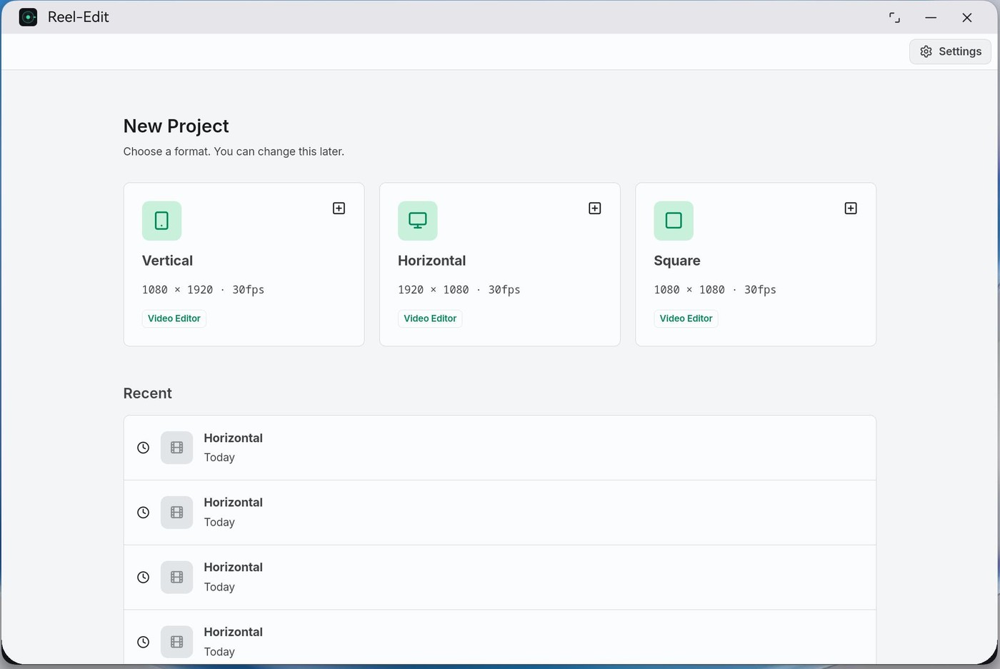
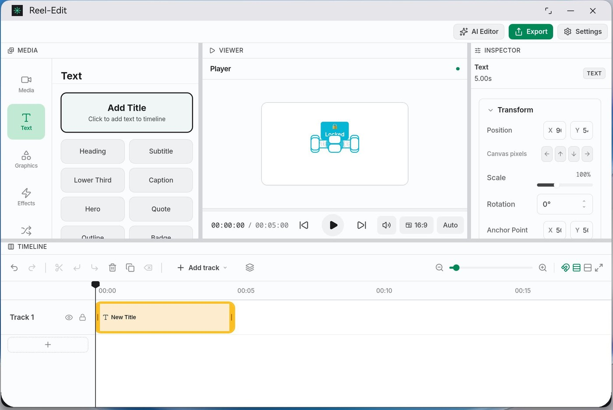
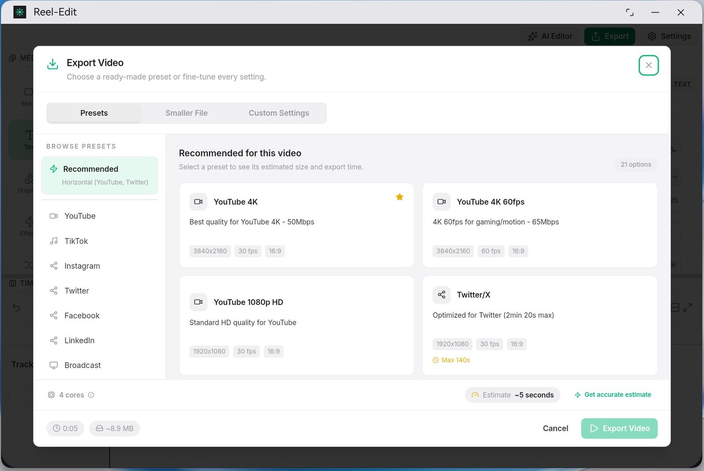

<div align="center">
  
</div>

# Reel-Edit

<div align="center">
  <strong>A port of <a href="https://github.com/Augani/openreel-video">OpenReel Video</a> to HarmonyOS PC (2in1)</strong>
</div>

---

**Credits.** All of the editor — the timeline, engine, Media/Text/Graphics/Effects
panels, Viewer, Inspector and export pipeline in `apps/web` and `packages/core` —
is the work of the [OpenReel](https://github.com/Augani/openreel-video) developers
and contributors, under MIT licence. This repository is a port, not a
derivative design: the upstream source is used unmodified apart from the two
platform fixes called out below, and all credit for the application itself
belongs to them. What was added here is the HarmonyOS host (the ArkTS module,
the native encoder, the bridge, the build and release tooling) and the Reel-Edit
branding.

## Screenshots

| Start | Editor | Export |
| :---: | :---: | :---: |
|  |  |  |

*A 2in1 emulator at 3120x2080, showing the light theme following the device
setting. Only the platform's own window buttons are drawn — see below.*

## What it is

Target: **HarmonyOS 6.1.1 (API 24)**, device type `2in1`.

Verified on the 2in1 emulator (3120x2080):

- The full editor — start screen, project formats, Media / Text / Graphics /
  Effects panels, Viewer, Inspector, Timeline, undo/redo, clip selection.
- Project create and open, with projects persisting across launches.
- The export flow end to end: save picker (HarmonyOS `DocumentViewPicker`),
  the renderer's frame stream, and the native MP4 muxer, which accepts both
  video and audio tracks.
- Light and dark themes, following the device setting.

### Known limitation: MP4 export needs a hardware encoder

The **2in1 emulator image ships with no H.264 or AAC encoder**. Export
therefore stops at encoder creation and the app says so plainly:

```
This device has no H.264 encoder, so MP4 export is unavailable.
```

`probeHardware` reports `encoders: []` on that image, which is read straight from
the platform (`OH_VideoEncoder_CreateByMime`) rather than assumed. On HarmonyOS
PC hardware, which has a video encoder, the same pipeline is expected to
complete; every step up to that point is verified working here. Nothing else
about the port depends on the encoder being present — editing, import and
preview are unaffected.

Two upstream behaviours are changed for this platform, both in
`apps/web/src/desktop/`:

- **Window controls are not drawn in-app.** HarmonyOS renders its own minimise /
  maximise / close buttons on the window, so the editor's title bar would
  otherwise show two sets. `WindowControls` renders nothing when
  `window.openreel.win` is absent, which is how the bridge signals this.
- **The theme follows the device.** `desktop-theme.css` defines both schemes
  inside explicit `prefers-color-scheme` blocks. The dark set must not be
  unconditional — an unconditional block later in the cascade wins regardless of
  the device setting and pins the editor to dark. The host uses
  `WebDarkMode.Auto` and also pushes the system colour mode from
  `onConfigurationUpdate`.

## Layout

| Path | Purpose |
| :--- | :--- |
| `apps/web` | Upstream editor, unmodified apart from the two changes above |
| `packages/core` | Upstream engine: timeline, media, audio, rendering |
| `entry/src/main/ets/pages/Index.ets` | ArkWeb host; serves the bundle over a virtual origin |
| `entry/src/main/ets/services/OpenReelBridge.ets` | The `window.openreel` API |
| `entry/src/main/ets/services/NativeExport.ets` | Export job manager |
| `entry/src/main/ets/services/ReelNative.ets` | ArkTS binding for the native encoder |
| `entry/src/main/cpp/reel_export.c` | H.264/AAC + MP4 muxing via the platform media framework |
| `entry/src/main/cpp/reel_napi.c` | Node-API surface for the above |
| `entry/src/main/resources/rawfile/web/reel_bridge.js` | Page-side bridge adapter |
| `scripts/build-harmony.sh` | One-command build |
| `scripts/build-web-for-harmony.mjs` | Stages the bundle into the HAP rawfile |
| `scripts/generate-icons.py` | Draws the app icon (film reel, app palette) |

## How the bridge works

The desktop build exposes a single `window.openreel` object over Electron IPC
(`apps/desktop/src/preload/index.ts`). Every call site in `apps/web` is written
against that object, which is why the upstream source runs here unchanged. The
port reimplements it in ArkTS and registers it with `registerJavaScriptProxy`.

Three platform constraints shaped the implementation, each verified against the
device rather than assumed:

1. **The async JS proxy does not marshal a returned `Promise` reliably.** The
   page observes an empty result while the real value arrives seconds later, so
   `.then()` fails. The proxy is registered as *synchronous* and only hands the
   request over; the reply is pushed into the page afterwards through
   `window.__openreelResolve(id, payload)`, which settles the promise the page
   adapter created for that request id.

2. **Binary values cannot cross the JSON proxy**, so file reads and remote
   fetches return base64.

3. **The message-port handoff does not deliver.** `createWebMessagePorts` +
   `WebviewController.postMessage` succeeds natively but the page listener never
   fires, which left the renderer waiting on a channel that never arrived. Export
   frames therefore travel over the JSON bridge as base64 — slower than a
   transferred `ArrayBuffer`, but it is the transport verified to work in both
   directions. The renderer still gets the DOM `MessagePort` it expects, via a
   `MessageChannel` whose far end is handed over through the same
   `__openreelExportPort` message the desktop preload uses, so
   `NativeFFmpegBackend` runs verbatim.

The web bundle is served through `onInterceptRequest` over a virtual
`https://openreel.harmony.local` origin rather than `file://` or `resource://`,
because ArkWeb blocks cross-origin sub-resource loads for those and the built app
fetches its JS chunks, fonts and WASM from its own origin. MIME types are set
explicitly, since the kernel has no extension table for intercepted rawfile
responses.

### Native export

`reel_export.c` replaces the desktop FFmpeg sidecar with the platform's own
media framework: `OH_VideoEncoder` (H.264) and `OH_AudioEncoder` (AAC) feeding
`OH_AVMuxer` (MP4). It reproduces the sidecar's frame-credit backpressure, so
the renderer's throttling loop is unchanged.

Two details are worth knowing if this is extended:

- `OH_AVCODEC_MIMETYPE_VIDEO_AVC` / `_AUDIO_AAC` are declared as
  `extern const char *`, but the platform libraries export them as **functions**
  rather than data. Reading them through the pointer yields a code address, not a
  string, and every encoder and muxer call fails with `AV_ERR_INVALID_VAL`. The
  literal mime values are used instead.
- The buffer interface on API 24 is the index-based one
  (`QueryInputBuffer` / `GetInputBuffer` / `PushInputData`) or
  `PushInputBuffer`, with `GetBufferAttr` / `SetBufferAttr` for attributes;
  there is no `QueueInputBuffer` / `DequeueOutputBuffer`.

## Prerequisites

All reachable without a mainland-China proxy:

- HarmonyOS Command Line Tools 6.1.1 (hvigor 6.24.2, ohpm 6.1.2, SDK 6.1.1 API 24)
- JDK 17 (`brew install openjdk@17`)
- Node 18+ and pnpm 11.7.0 (`npm i -g pnpm@11.7.0`)
- `~/.npmrc` containing `@ohos:registry=https://repo.harmonyos.com/npm/`

## Build

```bash
export PATH="$HOME/Developer/command-line-tools/bin:$PATH"
export JAVA_HOME="/opt/homebrew/opt/openjdk@17/libexec/openjdk.jdk/Contents/Home"
export DEVECO_SDK_HOME="$HOME/Developer/command-line-tools/sdk"

pnpm install                    # workspace deps
pnpm --filter @openreel/core build:wasm   # engine WASM (not checked in)
./scripts/build-harmony.sh      # typecheck + web bundle + HAP
```

Outputs:

```
entry/build/default/outputs/default/entry-default-unsigned.hap
build/outputs/default/Reel-Edit-default-unsigned.app
```

Debug builds are unsigned by default, so the build emits
`entry-default-unsigned.hap`.

### Signing

A signed HAP needs material only Huawei issues, so it cannot be produced
offline:

- a certificate (`.cer`) and its private key (`.p12`), and
- a **provisioning profile** (`.p7b`) bound to `com.reeledit.harmony`.

The profile is signed by `Provisionsigntool`, which authenticates against a
Huawei w3 account (`--username` / `--password`), so `signingConfigs` is empty in
`build-profile.json5` and the exact snippet to add is documented there. With a
free [HarmonyOS developer account](https://developer.huawei.com/consumer/en/)
(AppGallery Connect, or DevEco Studio's automatic signing) the three files drop
into `signing/`, which is git-ignored — never commit a private key.

## Checks

```bash
pnpm --filter @openreel/web typecheck
pnpm --filter @openreel/web test:run    # 863 tests, 163 files
```

## Emulator (HarmonyOS PC, 2in1)

Image download via `Emulator -install` is geo-gated to the Chinese mainland
since DevEco 6.1.0 Beta1. No proxy software is needed — the locale and timezone
exports below are enough:

```bash
export PATH="$HOME/Developer/command-line-tools/bin:$PATH"
export LANG=zh_CN.UTF-8
export LC_ALL=zh_CN.UTF-8
export TZ=Asia/Shanghai

Emulator -license accept
Emulator -imageList -deviceType 2in1     # works globally, no proxy
Emulator -install -deviceType 2in1 -osVersion "HarmonyOS 6.1.1(24)" -force
# ~2 GB ARM64 image -> ~/Library/Huawei/Sdk/system-image/HarmonyOS-6.1.1/pc_all_arm/

Emulator -create ReelEditPC -deviceType 2in1 -osVersion "HarmonyOS 6.1.1(24)"
# CLI-tools layout fix so the Emulator UI finds hdc (it looks in ~/Developer/sdk):
ln -sfn ~/Developer/command-line-tools/sdk ~/Developer/sdk
Emulator -start ReelEditPC
```

`2in1` is the HarmonyOS PC form factor; `phone`/`tablet` images are separate
downloads.

Once `hdc` reports the device (it appears as `127.0.0.1:5555` after boot):

```bash
HDC=~/Developer/command-line-tools/sdk/default/openharmony/toolchains/hdc
$HDC -t 127.0.0.1:5555 install -r entry/build/default/outputs/default/entry-default-unsigned.hap
$HDC -t 127.0.0.1:5555 shell aa start -b com.reeledit.harmony -a EntryAbility
```

## Mobile

Upstream ships **no mobile version**. `apps/web/src/components/MobileBlocker.tsx`
deliberately blocks every viewport under 768px with a "Desktop Only" screen, and
the editor is a fixed desktop grid needing roughly 800px before the stage gets
any width: panel resizing is mouse-only, clip box-select and track reordering use
mouse events and HTML5 drag-and-drop (neither fires on touch), and timeline zoom
is Ctrl+wheel only. A phone-sized window renders the editor clipped and
unusable rather than gracefully.

So a mobile port cannot be 1:1 with an existing mobile UI — it would be a new
layout: single-column stacked preview/timeline, bottom-sheet inspector, touch
gestures for select/trim/reorder/pinch-zoom, and its own export hookup. The core
engine, bridges, preview sizing and timeline scroller are all reusable; the
React layout layer is not. That work has not been started.
